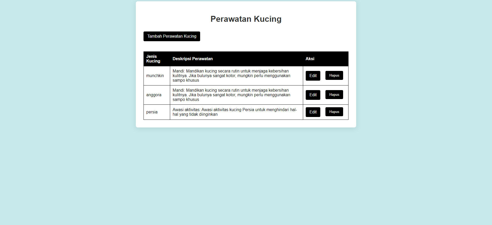

# Aplikasi Perawatan Kucing

## deskripsi

### Aplikasi Perawatan Kucing adalah platform yang dirancang untuk membantu pemilik kucing dalam merawat dan menjaga kesehatan kucing mereka. Aplikasi ini menyediakan berbagai fitur yang berguna, termasuk:

Jadwal Perawatan: Pengguna dapat membuat jadwal rutin untuk memberi makan, memandikan, dan pemeriksaan kesehatan kucing.

Catatan Kesehatan: Fitur untuk mencatat riwayat kesehatan kucing, termasuk vaksinasi, kunjungan dokter hewan, dan obat-obatan yang diberikan.

Panduan Perawatan: Artikel dan tips mengenai perawatan kucing, termasuk nutrisi, perawatan bulu, dan tips kesehatan.

Pengingat: Notifikasi untuk pengingat aktivitas perawatan, seperti waktu memberi makan dan jadwal vaksinasi.

Forum Komunitas: Tempat bagi pemilik kucing untuk berbagi pengalaman dan bertanya tentang perawatan kucing.

Aplikasi ini bertujuan untuk memberikan informasi dan alat yang dibutuhkan pemilik kucing untuk memastikan kucing mereka sehat, bahagia, dan terawat dengan baik.

